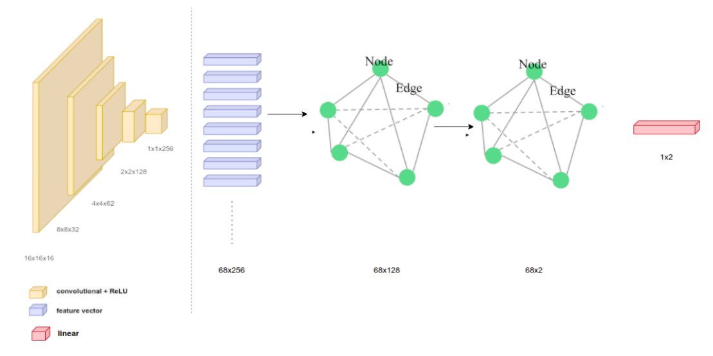
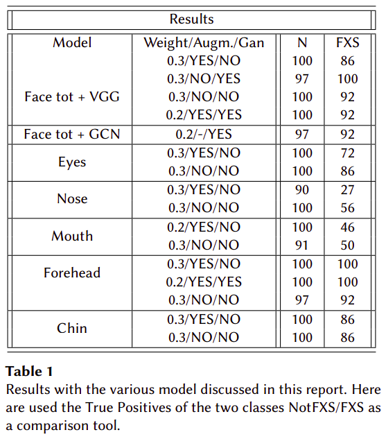

# Face Recognition of Children with Martin-Bell syndrome using enhancing dataset techniques
This repository contains the final project for the module "AI for Visual Perception in HCI & HRI" of Electives in AI (Master in Artifical Intelligence and Robotics, Sapienza University, Rome) held by prof. Christian Napoli during the accademic year 2020/2021. 

## Table of Contents
- [Face Recognition of Children with Martin-Bell syndrome using enhancing dataset techniques](#Face-Recognition-of-Children-with-Martin-Bell-syndrome-using-enhancing-dataset-techniques)
  - [Table of Contents](#table-of-contents)
  - [Description](#description)
  - [Installation](#installation)
  - [Usage](#usage)
  - [Contributing](#contributing)
  - [License](#license)
  - [Acknowledgements](#acknowledgements)

## Description
One of the numerous applications of modern face recognition techniques is the diagnosis of rare dysmorphic syndromes, characterized by abnormal facial features, among other factors. While this problem shares some characteristics with other image classification tasks, it presents peculiar challenges, such as samples scarcity and the need to recognize specific patterns  in facial features. This report describes how a combination of various techniques, specifically Graph Convolutional Neural Networks (GCNNs) and image augmentation, can be applied to address these challenges. Furthermore, the high performance of the proposed method is demonstrated through a series of tests conducted on a custom dataset designed specifically for recognizing children with X-Fragile Syndrome (FXS). The experiments highlight that the combination of graph CNNs, feature attention, and data augmentation with the classic VGG model surpasses the baseline in terms of accuracy, specificity and sensitivity.

### Dataset
A fundamental step of the project was to construct the dataset because: (i) being FXS a rare disease, there are not many publicly available frontal images of children online; (ii) dealing with children adds difficulty in acquiring public images due to specific privacy laws for minors; (iii) often, the available photos are low-resolution, nonfrontal, or contain elements obstructing the face. 

The methods employed to increase the dataset’s size can be divided into three categories: (i) data augmentation via image transformation, (ii) image generation, and (iii) face segmentation and landmarks attention. 
The datasets created with the different methods are store the folder [dataset](datasets). 
### Model
The models used primarily follow two structures: the first one is based on VGG-16 and consists of a fine-tuned model of VGG pre-trained using the weights of VGGFace. The second one is a custom-based model based on graph CNNs.

Structure of the graph-based neural network proposed. Each 32x32 feature image is passed through 5 convolutional layers, each one of them followed by a ReLU. The features extracted create the 68 nodes of the graph that is fed to two consecutive GCN, each followed by a ReLU. The 68x2 output is converted into a binary classification output through a single linear layer.

The networks implementation can be found in 
### Results
In the table below can be found the results in terms of f1-score and loss of the different combinations of models and augmentations, for the whole face and the segmentation defined. The results show that the graph-based not only matches the VGG ones but also goes beyond them while keeping (i) a much lower number of parameters and consequently (ii) a faster training time (even though it needs a higher number of epochs to converge).
The application of the data augmentation techniques has been generally beneficial, both in terms of random transformations and generative approaches application.

## Installation
## Usage
## Contributing
## License
## Acknowledgements

